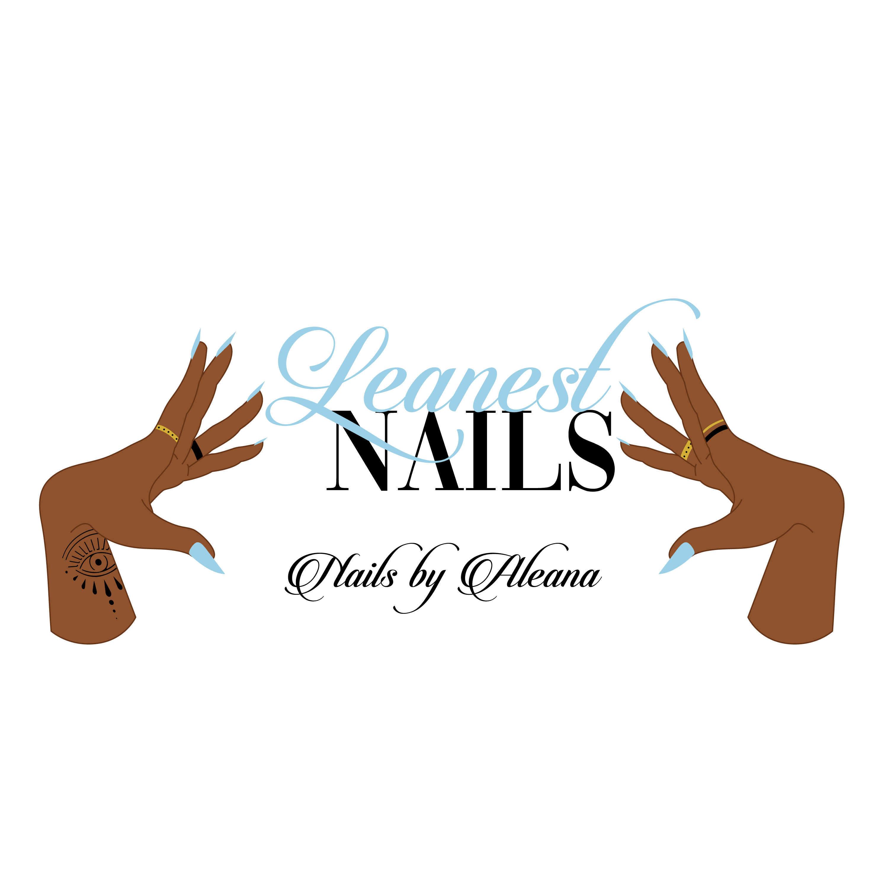

<!-- PROJECT LOGO -->

  

  <h3 align="center">The Leanest Nails - CRUD Application</h3>

  

                MERN stack
    Reservation Scheduling | E-commerce
     
    <a href="http://theleanestnails.herokuapp.com/">View Demo</a>
     ·
    <!-- <a href="https://www.youtube.com/watch?v=6skXNTfSanQ">Watch Video Demo</a> -->
    ·
  

## Functionality

<strong>Guest clients are able to:</strong>
* Choose an available date and time slot for their appointment.
  * The MUI calendar automatically disables any dates not authorized by the admin.
* Fill out contact information and any appointment notes.
* Cancel their appointment which will then update the date and time slot to available as long as that date is not in the past.
* Book selected appointments and receive:
  * Confirmation number
  * Confirmation emails using EJS (Embded Javscript Templates) via Nodemaier.
* Contact the admin via a resuable form component.
* Add and remove products to their carts (press on nails).
* Submit credit card information securely through Paypal or Stripe.

<strong>Authenticated users with "admin" status are able to:</strong>
* Create a date and time to add to the MUI calendar as dates available for the guest to reserve.
* Delete a date and time that will prevent a user from creating a reservation.
* Create a new product which includes as follows: a photo, description, price, and quantity.
* Delete a product.
* Retrieve a list of previous transactions.
* Upload website media via firebase.

## Technologies
* React
* Redux
* MongoDb Atlas
* Express
* Node
* Axios
* Material UI
* NodeMailer
* Paypal
* Stripe
* Firebase

## Contact Me (Junior Developer)

Asia Thomas - amthoms2@illinois.edu
<a href="https://www.linkedin.com/in/amthoms2/">LinkedIn</a>

<!-- ACKNOWLEDGEMENTS -->
## Acknowledgements
* Instagram icon in emails-> https://www.iconfinder.com/icons/5296765/camera_instagram_instagram_logo_icon
* Thank you card email photo -> https://www.pexels.com/photo/text-7564279/
* Shop small help big -> https://www.pexels.com/photo/black-and-white-happy-birthday-card-7563663/
